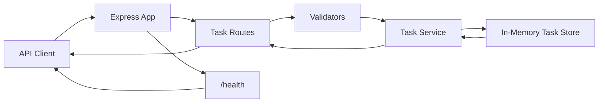
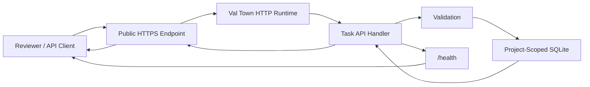
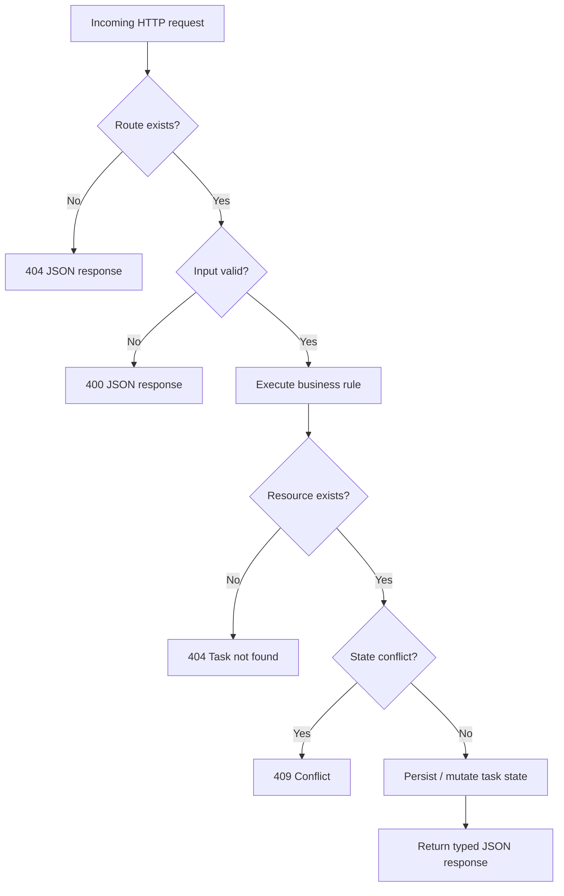
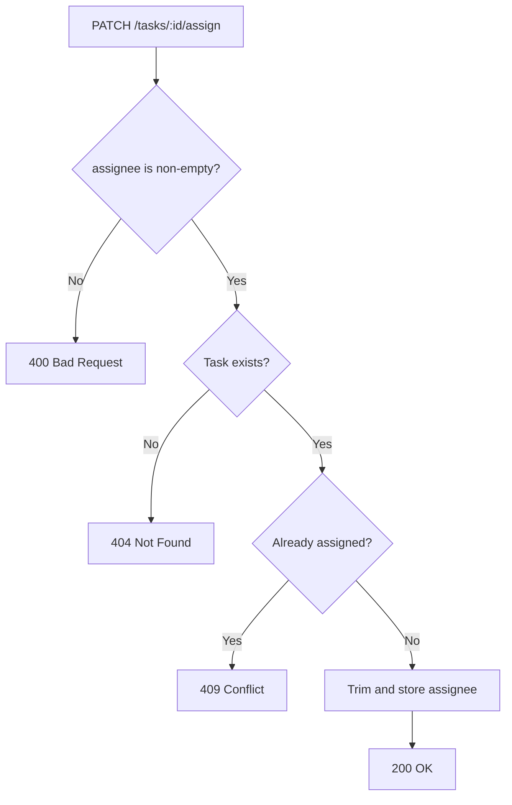
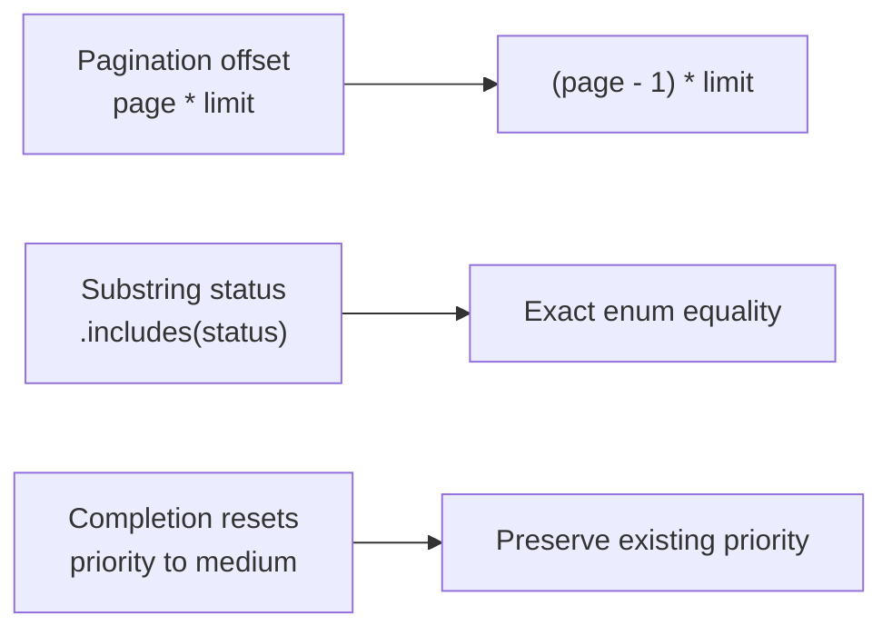
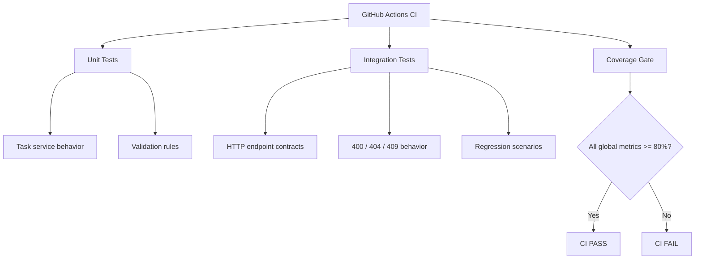
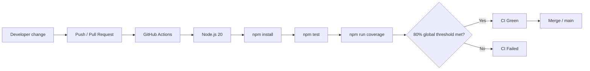
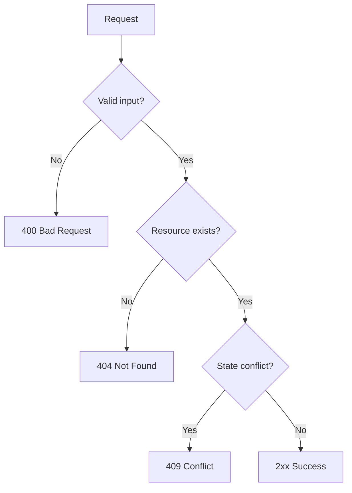

# Taroo Full Stack Developer Intern — Take-Home Assignment

> **The Untested API — completed, tested, documented, and publicly deployed.**

[](https://github.com/affanSkhan/taroo-fullstack-assignment/actions/workflows/ci.yml)

A production-minded solution to Taroo's Full Stack Developer Intern take-home assignment. The work focuses on **behavior-first testing, targeted bug fixing, explicit API contracts, edge-case handling, and a complete implementation of the requested task-assignment endpoint**.

---

## 1. Executive Summary

The starter API contained correctness defects that could silently return the wrong records or mutate unrelated task data. The solution first reproduced those behaviors with regression tests, then fixed them without introducing unnecessary framework or architecture changes.

The assignment also required:

- Comprehensive unit and integration testing
- At least one bug fix
- A new `PATCH /tasks/:id/assign` endpoint
- Input validation and edge-case handling
- **80%+ coverage**
- Documentation suitable for reviewer handoff
- A deployable API with a health-check endpoint

All core requirements are implemented.

### Verified results

| Area | Result |
|---|---:|
| Test suites | **3 / 3 passed** |
| Tests | **43 / 43 passed** |
| Statement coverage | **97.31%** |
| Branch coverage | **92.64%** |
| Function coverage | **94.28%** |
| Line coverage | **97.60%** |
| Global Jest threshold | **80%** |
| CI runtime | **Node.js 20.20.2 / Ubuntu 24.04** |
| Live health check | **HTTP 200** |
| Live task listing | **HTTP 200** |
| Live stats endpoint | **HTTP 200** |
| Unknown route handling | **HTTP 404 JSON** |

Full verification details are available in [TEST_REPORT.md](./TEST_REPORT.md).

---

## 2. Live Demo

### Public API

**https://affankhan--6cb5d158bb3711f194981607ee4eb77e.web.val.run**

Verified endpoints include:

| Request | Expected result |
|---|---|
| `GET /health` | `200 { "status": "ok" }` |
| `GET /tasks` | `200` with task array |
| `GET /tasks/stats` | `200` with counters |
| Unknown route | `404` JSON error |

The public deployment is a live API mirror of the assignment contract running on Val Town's HTTP runtime with project-scoped SQLite persistence.

> **Repository vs. live runtime:** the assignment repository intentionally keeps its original in-memory architecture to stay close to the starter exercise. The public deployment uses SQLite so the reviewer can interact with a persistent live service without changing the assignment's repository design.

---

## 3. What Was Built

### Core API

- `GET /health`
- `GET /tasks`
- `GET /tasks?status=<status>`
- `GET /tasks?page=<page>&limit=<limit>`
- `POST /tasks`
- `PUT /tasks/:id`
- `DELETE /tasks/:id`
- `PATCH /tasks/:id/complete`
- `PATCH /tasks/:id/assign`
- `GET /tasks/stats`

### Quality and engineering work

- Exact status filtering instead of substring matching
- Correct one-indexed pagination
- Preservation of task priority during completion
- Strict status and priority enums
- Validation for title, assignee, due date, and pagination
- `404` handling for missing resources
- `409 Conflict` for duplicate task assignment
- Regression tests for discovered defects
- Global Jest coverage thresholds
- GitHub Actions CI
- Reviewer-focused documentation
- Render deployment configuration
- Verified live API deployment

---

# 4. System Architecture

## Repository implementation

The repository preserves the assignment's simple Node/Express structure.



### Separation of concerns

| Layer | Responsibility |
|---|---|
| Express app | HTTP server, middleware, error handling |
| Routes | HTTP semantics, status codes, request/response mapping |
| Validators | Input and query validation |
| Service | Task business rules and state transitions |
| Tests | Regression protection and API contract verification |

---

## Live deployment architecture

The live mirror uses persistent SQLite storage while keeping the same external API contract.



---

# 5. Request Lifecycle

Every request follows the same basic pipeline:



This keeps validation and error semantics explicit instead of allowing malformed input to flow into business logic.

---

# 6. API Contract

## Endpoint matrix

| Method | Endpoint | Success | Typical errors | Purpose |
|---|---|---:|---|---|
| GET | `/health` | 200 | — | Health/readiness check |
| GET | `/tasks` | 200 | 400 | List tasks |
| GET | `/tasks?status=todo` | 200 | 400 | Exact status filter |
| GET | `/tasks?page=1&limit=10` | 200 | 400 | Paginated list |
| POST | `/tasks` | 201 | 400 | Create task |
| PUT | `/tasks/:id` | 200 | 400, 404 | Update task |
| DELETE | `/tasks/:id` | 204 | 404 | Delete task |
| PATCH | `/tasks/:id/complete` | 200 | 404 | Complete task |
| PATCH | `/tasks/:id/assign` | 200 | 400, 404, 409 | Assign task |
| GET | `/tasks/stats` | 200 | — | Task and overdue counts |

### Supported enums

**Status**

```
todo
in_progress
done
```

**Priority**

```
low
medium
high
```

---

## Assignment endpoint

### Request

```http
PATCH /tasks/:id/assign
Content-Type: application/json

{
  "assignee": "Affan Khan"
}
```

### Behavior



The endpoint intentionally returns **409 Conflict** when ownership already exists instead of silently overwriting it.

Example successful response:

```json
{
  "id": "task-id",
  "title": "Example task",
  "description": "Example description",
  "status": "todo",
  "priority": "high",
  "dueDate": null,
  "assignee": "Affan Khan",
  "completedAt": null,
  "createdAt": "2026-09-28T00:00:00.000Z"
}
```

---

# 7. Bugs Found and Fixed

The original implementation contained three important correctness defects.



| Bug | Original behavior | Correct behavior | Regression protection |
|---|---|---|---|
| Pagination | Page 1 skipped the first `limit` records | `(page - 1) * limit` | Pagination regression test |
| Status filter | Performed substring matching | Exact supported enum match | Filter + invalid-query tests |
| Completion | Changed unrelated priority | Preserve existing priority | High-priority completion test |

Detailed reproduction steps and root-cause analysis are documented in [BUG_REPORT.md](./BUG_REPORT.md).

---

# 8. Testing Strategy

The test suite is deliberately split by responsibility.



### Coverage result

| Metric | Result | Required |
|---|---:|---:|
| Statements | **97.31%** | 80% |
| Branches | **92.64%** | 80% |
| Functions | **94.28%** | 80% |
| Lines | **97.60%** | 80% |

### Test organization

```
task-api/tests/
├── taskService.test.js   # business logic + regressions
├── validators.test.js    # request/input contracts
└── routes.test.js        # Supertest HTTP integration
```

The verified CI run completed **43/43 tests across 3/3 suites**.

See [TEST_REPORT.md](./TEST_REPORT.md) for the verification record.

---

# 9. CI/CD Workflow

Every push to `main` and every pull request runs the same quality pipeline.



CI configuration lives in:

```
.github/workflows/ci.yml
```

---

# 10. Local Setup

### Prerequisites

- Node.js 18+
- npm

### Install and test

```bash
cd task-api
npm install
npm test
npm run coverage
```

### Start the API

```bash
npm start
```

By default the local server listens on port `3000`.

---

# 11. Example Requests

### Create a task

```http
POST /tasks
Content-Type: application/json

{
  "title": "Review candidate submissions",
  "description": "Complete the first-pass review",
  "priority": "high"
}
```

### Filter by status

```http
GET /tasks?status=in_progress
```

### Paginate

```http
GET /tasks?page=1&limit=10
```

### Complete a task

```http
PATCH /tasks/<id>/complete
```

### Assign a task

```http
PATCH /tasks/<id>/assign
Content-Type: application/json

{
  "assignee": "Affan Khan"
}
```

### Get statistics

```http
GET /tasks/stats
```

---

# 12. Error Handling

The API uses straightforward HTTP semantics:



Error responses are JSON and are designed to be predictable for clients and easy to exercise in automated tests.

---

# 13. Project Structure

```
taroo-fullstack-assignment/
├── .github/
│   └── workflows/
│       └── ci.yml
├── task-api/
│   ├── src/
│   │   ├── app.js
│   │   ├── routes/
│   │   │   └── tasks.js
│   │   ├── services/
│   │   │   └── taskService.js
│   │   └── utils/
│   │       └── validators.js
│   ├── tests/
│   │   ├── routes.test.js
│   │   ├── taskService.test.js
│   │   └── validators.test.js
│   ├── jest.config.js
│   └── package.json
├── BUG_REPORT.md
├── README.md
├── SOLUTION_NOTES.md
├── TEST_REPORT.md
└── render.yaml
```

---

# 14. Design Decisions

### Why 409 for an already-assigned task?

Assignment changes task ownership. Silently replacing an existing assignee could hide a data-integrity problem, so the API makes the conflict explicit.

### Why keep pagination one-indexed?

The external API is easier to consume when `page=1` represents the first page. The implementation translates that value internally to a zero-indexed offset.

### Why avoid unrelated architecture changes?

The goal was to demonstrate careful engineering against the supplied codebase. The solution therefore favors focused changes over unnecessary migrations, authentication systems, database rewrites, or framework changes.

More reasoning is documented in [SOLUTION_NOTES.md](./SOLUTION_NOTES.md).

---

# 15. Security and Reliability Considerations

The assignment is intentionally small, but the implementation applies several useful API hygiene practices:

- Strict input validation
- Enum validation for constrained fields
- Parameterized SQL in the live deployment
- Explicit error status codes
- No silent reassignment of task ownership
- Automated regression coverage
- Global test-coverage enforcement
- Dedicated health endpoint
- No server-generated stack traces returned as normal API responses

For a production system, the next layer would include authentication, authorization, persistent repository abstractions, structured logging, rate limiting, API schema documentation, and stronger concurrency guarantees.

---

# 16. Reviewer Guide

This repository is organized so the assignment can be reviewed quickly:

| File | What to inspect |
|---|---|
| [task-api/src/routes/tasks.js](./task-api/src/routes/tasks.js) | HTTP contract and endpoint behavior |
| [task-api/src/services/taskService.js](./task-api/src/services/taskService.js) | Core business logic and bug fixes |
| [task-api/src/utils/validators.js](./task-api/src/utils/validators.js) | Validation rules |
| [task-api/tests/routes.test.js](./task-api/tests/routes.test.js) | End-to-end HTTP behavior |
| [task-api/tests/taskService.test.js](./task-api/tests/taskService.test.js) | Unit tests and regressions |
| [task-api/tests/validators.test.js](./task-api/tests/validators.test.js) | Validation coverage |
| [BUG_REPORT.md](./BUG_REPORT.md) | Original bugs, reproduction and fixes |
| [SOLUTION_NOTES.md](./SOLUTION_NOTES.md) | Design decisions and trade-offs |
| [TEST_REPORT.md](./TEST_REPORT.md) | Verified CI results |
| [render.yaml](./render.yaml) | Conventional Node deployment configuration |

---

# 17. Submission Checklist

- [x] Full Stack take-home requirements implemented
- [x] `PATCH /tasks/:id/assign` implemented
- [x] Bugs reproduced and documented
- [x] Bugs fixed with regression tests
- [x] Validation and error handling added
- [x] Unit tests added
- [x] Integration tests added
- [x] 80%+ coverage requirement exceeded
- [x] GitHub Actions CI configured
- [x] Live API deployed
- [x] Live API manually verified
- [x] Reviewer documentation added

---

## Final Status

**Assignment implementation:** Complete  
**Automated verification:** Passed — **43/43 tests**  
**Coverage gate:** Passed — **all metrics above 80%**  
**Live API:** Public and verified  
**Documentation:** Complete

---

### Author

**Affan Khan**  
B.Tech Computer Engineering — VIIT Pune
